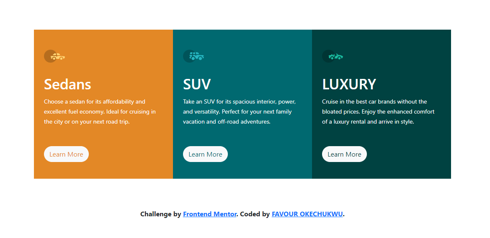

# Frontend Mentor - 3-column preview card component solution

This is a solution to the [3-column preview card component challenge on Frontend Mentor](https://www.frontendmentor.io/challenges/3column-preview-card-component-pH92eAR2-). Frontend Mentor challenges help you improve your coding skills by building realistic projects. 
***This is my first bootstrap project.***
## Table of contents

- [Overview](#overview)
  - [The challenge](#the-challenge)
  - [Screenshot](#screenshot)
  - [Links](#links)
- [My process](#my-process)
  - [Built with](#built-with)
  - [What I learned](#what-i-learned)
  - [Continued development](#continued-development)
  - [Useful resources](#useful-resources)
- [Author](#author)

### The challenge

Users should be able to:

- View the optimal layout depending on their device's screen size
- See hover states for interactive elements

### **Screenshot**

### Links

-  Solution URL: [**Here's the solution**](https://github.com/favourpro/3-column-preview-card-component-challenge-on-Frontend-Mentor)
- Live Site URL: [**Here's what it looks like** ](https://favourpro.github.io/3-column-preview-card-component-challenge-on-Frontend-Mentor/)

## My process

## Built with

- Simple HTML5 markup
- CSS custom properties
- Bootstrap

## What I learned

Since this was my first bootstrap project, i actually ended up learning a lot from this. I learnt about 
- container and container - fluid, 
- bootstrap buttons 
- row and column 
 and other things which i can explain here...

### Continued development

Since this is my first bootstrap project, i intend to continue praticing on bootstrap, i can better understand it

### Useful resources
- [Bootstrap Website](https://getbootstrap.com/docs/5.0/layout/) - This is a useful resource that can help you get started with using bootstrap.

- [W3Schools.com](https://www.w3schools.com/bootstrap5/) - This is another very useful resource that you can easily use to check up one or two problems

## Author

- Frontend Mentor - [@Favourpro](https://www.frontendmentor.io/profile/favourpro)
- Twitter - [@Favourdev](https://www.twitter.com/favourdev)

